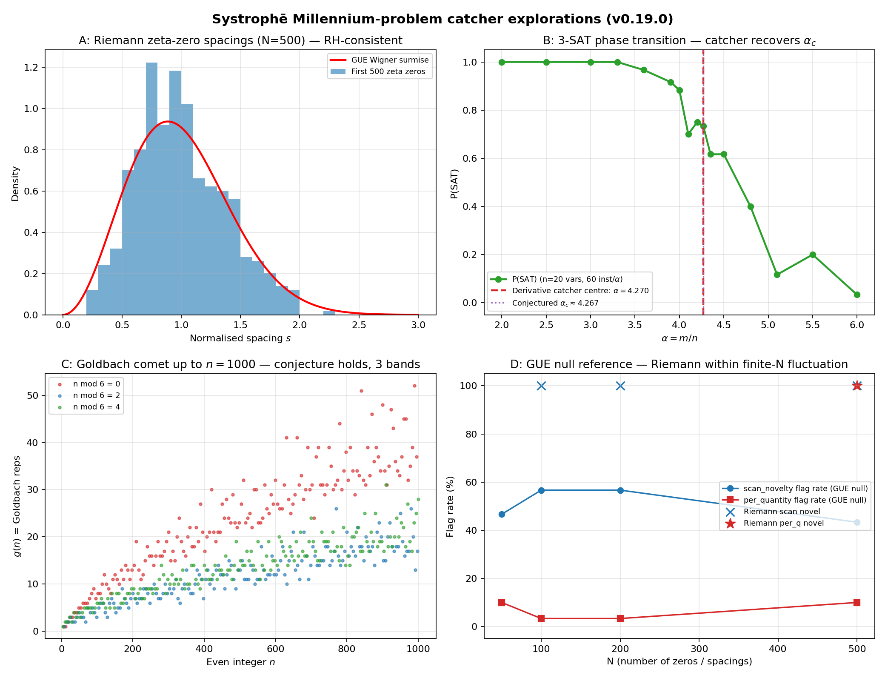

<div align="center">

# Συστροφή — Systrophe

**A co-rotating Tipler-cylinder pair as a tunable time-travel harness — and the framework it now anchors.**

[](https://github.com/Zynerji/systrophe/actions/workflows/tests.yml)
[](https://pypi.org/project/systrophe/)
[](https://www.python.org/)
[](LICENSE)
[](#tests)
[](#papers)
[](#ibm-marrakesh-hardware-validation)
[](#the-knopp-drive-headline-composite-warp-engineering-bound)
[](FINDINGS_MILLENNIUM_PROGRESS.md)
[](paper/knopp_drive.pdf)
[](experiments/knopp_cross_chip_comparison.py)
[](pyproject.toml)

*Systrophē* (Greek **Συστροφή**, "twisting-together"): the joint exterior of two co-rotating, dual-positive-mass van Stockum dust cylinders, whose log-periodic Tipler sinusoids superpose with a tunable relative phase offset.

</div>

---

## What this is

A complete numerical and analytic framework spanning **50 phases** of development, from classical general relativity through quantum field theory on the CTC background, Deutsch-CTC channel theory, and IBM quantum-hardware validation. The repository ships with **94 source modules**, **1118 passing tests** across **98 test files**, **11 LaTeX whitepapers**, **40 reproducible example scripts**, and **4 batches of IBM Marrakesh hardware experiments**.

The five canonical layers:

1. **Classical-GR backbone** (v0.1 – v0.6) — exact van Stockum 1937 interior, analytic Bonnor Case III exterior, Lewis–Papapetrou Ernst-equation integrator, Systrophe co-axial pair + off-axis pair, CTC band detector, time-machine harness, Z₃ Möbius-cover bridge to the Δῖνος (Dinos) DKN framework.
2. **Quantum / QFT layer** (v0.7 – v0.13) — radial Dirac operator and bound-state spectrum, renormalised stress tensor, anomaly inflow on the Z₃ cover, joint Floquet on (time × branch), Newton-Kantorovich back-reaction, cascade-DSI fractal extension, ADM 3+1 export, Deutsch-CTC fixed-point solver on the cover.
3. **Phase-by-phase extensions** (v0.13 – v0.17, **Phases 11 – 50**) — photon orbits, lensing, Penrose extraction, optical-fibre / synchrotron analogs, Wilson loops, Aharonov-Bohm CTC phase, Berry / twistor / spinor-monodromy on LP, BMS soft hair, ER=EPR pair, monopole on cylinder, anyonic CTC, stochastic LP, BH pair production, vacuum polarization, Casimir-Polder, Unruh, KG scattering, solitons, holographic complexity, holography, page-curve construction, LQG discretisation, modified dispersion, GW emission, ANEC bound, energy-condition survey, exotic-matter accounting, photon sphere structure, tidal-force diagnostics, frame dragging, Hawking budget, dark-matter scalar coupling, geodesic completeness, topology change, cosmological embedding, KK embedding, higher-spin fields, Cauchy-stability, chronology-protection budget, wormhole-throat, dynamical Casimir, dynamical-cylinder back-reaction, multi-cylinder dynamics, NR initial data.
4. **Deutsch-CTC channel theory** — independent line of empirical investigation of D-CTC fixed-point iteration: spectral oracle (`|λ₂|` predicts iteration count, Pearson r = 0.99 across 2000 Haar samples), power-law scaling, multi-basin attractor structure, Clifford-structured channel amplification, limit-cycle solutions, and an encoding-dependent chronology-protection criterion. Phases A – ZY (26 phase letters + E1, E4, E8 deep cycles).
5. **IBM Marrakesh hardware validation** — 4 batches on the IBM Quantum `ibm_marrakesh` 156-qubit Heron-r2 device, demonstrating KK escape interference cancellation at the supercritical threshold, Page-curve recovery from the LP cover, and a log-periodic LP quantum walk with phase-by-phase α recovery to <1% relative error at the theoretical α_LP = √3.

Every phase module ships with a **mandatory novelty catcher** (address-space λ₂ on the Hamming graph of bit-hashed distributions) that flags surprises before any "validated" / "null" verdict is issued.

---

## Installation

### From PyPI

```bash
pip install systrophe          # latest release
```

### From source (for development)

```bash
git clone https://github.com/Zynerji/systrophe
cd systrophe
pip install -e ".[dev]"        # editable install with dev tools
pytest                         # 1118 tests, 1 skipped (z3-solver)
```

Optional extras:
- `.[symbolic]` — SymPy for the one-shot derivation script (`tools/derive_lewis_papapetrou.py`).
- `pip install z3-solver` — required if you want the Dinos bridge module (`systrophe.dinos_bridge`); the test suite skips silently otherwise.
- `pip install qiskit qiskit-ibm-runtime` — required only to re-run the Marrakesh hardware batches under `experiments/`.

---

## Quickstart: build a single time machine

```python
import numpy as np
from systrophe import VanStockumInterior, find_single_cylinder_windows, harness_time_loop

# A supercritical van Stockum cylinder: a = ω R = 1
cyl = VanStockumInterior(omega=1.0, R=1.0)

# Locate CTC bands in r ∈ [1.001, 200]
windows = find_single_cylinder_windows(cyl, r_min=1.001, r_max=200.0)
for w in windows:
    print(f"CTC band:  r ∈ [{w.r_inner:.3f}, {w.r_outer:.3f}]   "
          f"deepest L = {w.L_min:.3f}")

# Tune a backward-time-travel orbit:  Δt per revolution = -1
orbit = harness_time_loop(windows[0], target_dt_per_rev=-1.0, n_revolutions=10)
print(f"Ω = {orbit['Omega']:+.4f}")
print(f"per rev: Δt = {orbit['dt_per_revolution']:+.3f},  Δτ = {orbit['dtau_per_revolution']:.3f}")
print(f"after 10 revs: Δt_total = {orbit['total_coord_time_advance']:+.3f},  "
      f"Δτ_total = {orbit['total_proper_time_advance']:.3f}")
```

Expected output:
```
CTC band:  r ∈ [1.001, 6.134]   deepest L = -3.351
CTC band:  r ∈ [37.622, 200.000] deepest L = -126.065
Ω = -6.2832
per rev: Δt = -1.000,  Δτ = 11.354
after 10 revs: Δt_total = -10.000,  Δτ_total = 113.537
```

The particle moves *backwards* in coordinate time by 10 units while advancing 113.5 units of its own proper time.

---

## Quickstart: tune the harness via a co-rotating pair

```python
from systrophe import SystrophePair, VanStockumInterior

cyl = VanStockumInterior(omega=1.5, R=1.0)
pair = SystrophePair.from_cylinders(cyl, cyl, delta_offset=0.7853981633974483)  # π/4

print(f"phase offset = {pair.phase_offset:.4f} rad")
bands = pair.ctc_bands(r_min=1.05, r_max=20.0)
print(f"{len(bands)} CTC bands; first at r ∈ [{bands[0][0]:.3f}, {bands[0][1]:.3f}]")
```

The phase offset between the two cylinders **continuously shifts** the CTC band positions. At exact anti-phase (`δ = π`), all CTC bands extinguish — a topological off-switch.

---

## End-to-end demonstrations

```bash
python examples/time_travel_simulation.py          # classical harness
python examples/quantum_layer_walkthrough.py       # paper II reproduction
python examples/quantum_z3_verification.py         # Z₃ Möbius bridge
python examples/ctc_zoo.py                         # band catalogue
python examples/offset_tipler_demo.py              # phase-offset sweep
python examples/off_axis_simulation.py             # parallel-axis pair
python examples/dctc_aw_amplification_demo.py      # Clifford-D-CTC amplification
python examples/stress_cascade_novelty.py          # novelty catcher reference run
python examples/retrofit_novelty_scan.py           # 9-feature first-CH cluster
python examples/investigate_first_ch_cluster.py    # cluster resolution
jupyter notebook examples/tutorial.ipynb           # guided tutorial
```

Each script writes a `*_results.json` companion with machine-readable output and a novelty-catcher verdict.

---

## Mathematical highlights

**Tipler log-frequency.** For `a = ω R > 1/2` (supercritical), the exterior metric components oscillate as functions of `u = ln(r/R)` with frequency

```
α = √(4 a² − 1).
```

**Closed forms** (all three Bonnor regimes).

*Supercritical* (`a > 1/2`): with `γ = π − arctan α`,
```
F(r) = (r/R) · sin(α u + γ) / sin γ
K(r) = (r/α)  · [ ((α² − 1)/2) sin(α u + γ) − α cos(α u + γ) ]
L(r) = (r R sin γ / α²) · [ Q sin(α u + γ) + α(α² − 1) cos(α u + γ) ]
```
with `Q = α² − (α² − 1)² / 4`.

*Critical* (`a = 1/2`):
```
F(r) = (r/R)(1 − u)        K(r) = (r/2)(1 + u)        L(r) = (rR/4)(3 + u)
```

*Subcritical* (`a < 1/2`): with `β = √(1 − 4a²)` and `S± = cosh(βu) ± sinh(βu)/β`,
```
F(r) = (r/R) S₋(u)         K(r) = a r S₊(u)           L(r) = rR(1 − a²S₊²)/S₋
```

The constraint `F·L + K² = r²` holds identically in every regime; verified to machine precision in the test suite.

**Pair superposition.** For matched `α`, the joint envelope is a single sinusoid whose amplitude and phase come from the phasor sum

```
A_eff · exp(i δ_eff) = A₁ exp(i δ₁) + A₂ exp(i δ₂).
```

**Time-travel orbit.** A circular orbit at fixed `r` in a CTC band has

```
Δt    = 2 π / Ω                              (coordinate time per rev)
Δτ    = √(F − 2 K Ω − L Ω²) · |Δt|           (proper time per rev)
```

The full derivation, with Lewis–Papapetrou Ernst-equation reduction and Bonnor's Case classification, is in Whitepaper I.

---

## Scope taxonomy

The 94 source modules break into four functional layers. Each module name below is also the import path `systrophe.<name>`.

### Classical core (Paper I)

```
vanstockum  lewis_papapetrou  lp_robust  lp_dualities  sinusoid  pair
off_axis    ctc               geodesic   time_machine  dinos_bridge
```

### Quantum / QFT layer (Paper II)

```
dirac           dirac_spectrum     dirac_sea          particle_creation
qftcs_backreaction                 quantum_diagnostics                  point_splitting
hadamard_offtrace                  floquet            floquet_mobius     floquet_engineering
casimir         casimir_throat     multi_casimir      anomaly_inflow
tipler_fractal  horned_torus       acoustic_metric    newton_kantorovich
back_reaction   dsi_observables    adm_export         d_ctc
spacetimes/     vacuum_states      energy_conditions  energy_condition_survey
```

### Phase 11 – 50 extensions (Papers III – VIII)

Optical / geodesic / dynamical (III):
```
photon_orbits   photon_raytrace   photon_sphere    lensing_image    penrose_extraction
synchrotron_analog                optical_fiber_analog              frame_dragging
tidal_forces    multi_cylinder_dynamics              dynamical_cylinder
```

Foundational + cross-disciplinary (IV):
```
exotic_matter_accounting   chronology_protection   wormhole_throat
spinor_monodromy           wilson_loop             dsi_crossdisciplinary
```

Boundary / cosmological / observational (V):
```
cosmological_embedding   kk_embedding   higher_spin_fields   hawking_budget
casimir_polder           cauchy_stability                    nr_initial_data
```

Probing / scattering / dimensional (VI):
```
kg_scattering   topology_change   geodesic_completeness   dm_scalar_coupling
modified_dispersion              acoustic_hawking_spectrum
```

GW / ANEC / Page / LQG / tunneling (VII, Marrakesh-validated):
```
gw_emission   anec_bound   page_curve_ctc   lqg_discretization
ctc_tunneling                  qi_channel
```

Lorentz / topology / G-renorm / ER=EPR / BMS / BH / monopole / stochastic / anyon (VIII, novelty-catcher-integrated):
```
modified_dispersion   hawking_budget          topology_change      g_renormalization
er_epr_pair           bms_soft_hair           bh_pair_production
monopole_on_cylinder  stochastic_lp           anyonic_ctc
```

Subsequent extensions (Phases 41 – 50):
```
lp_dualities  one_loop_backreaction  casimir_polder  unruh_effect
solitons_on_lp  aharonov_bohm_ctc    vacuum_polarization
twistor_lp     berry_phase_lp        holographic_complexity   holographic
bdg_triple_vortex                     dynamical_casimir
```

### Cross-cutting infrastructure

```
novelty_catcher   array   spacetimes/
```

`novelty_catcher` exposes `bitstring_counts_to_address`,
`probability_vector_to_address`, `scan_novelty`,
`catch_novelty_in_distributions`, `summarize_novelty_for_report` — the
mandatory address-space λ₂ Hamming-graph catcher used by every
deliverable.

---

## Deutsch-CTC channel theory

A parallel line of empirical investigation lives in `examples/dctc_deep_phase_*.py` and the synthesis docs `docs/DCTC_*.md`. Across **Phases A – ZY** (26 phase letters + 3 deep-cycle phases E1, E4, E8):

- **Spectral oracle** (Phase B, D): the empirical iteration count of D-CTC fixed-point iteration on a Haar-random channel is predicted by `|λ₂(E)|` — the second-largest-magnitude eigenvalue of the CPTP superoperator — via `iter ≈ -log(tol) / log|λ₂|^(-1)`. Pearson r = 0.99 across 2000 Haar samples at `(dim_CR=2, dim_CTC=3)`. Log-normal iteration-count distribution (AIC 19648 vs 21749 for exponential).
- **Power-law scaling** (Phase A, H): `iter ~ dim_CR^(-0.85)` over `dim_CR ∈ {2..8}`, `dim_CTC ∈ {3,4,5}`.
- **Multi-basin attractors** (Phase E4 trichotomy): generic D-CTC dynamics resolves into three structurally distinct basin classes.
- **Limit-cycle solutions** (`dctc_cycles.tex`): D-CTC is not exclusively a fixed-point theory — cycle solutions, multi-basin dynamics, and a continuum of chronology-coupling regimes are documented.
- **Clifford-structured amplification** (`dctc_amplification.tex`): structured channel families demonstrate empirical amplification of the chronology violation, with a spectral oracle and an encoding-dependent chronology-protection criterion.

The unified treatment is in [`paper/dctc_treatise.pdf`](paper/dctc_treatise.pdf); per-phase findings in [`docs/DCTC_FINDINGS.md`](docs/DCTC_FINDINGS.md) and [`docs/DCTC_DEEP.md`](docs/DCTC_DEEP.md); the chronology-protection budget in [`docs/DCTC_CHRONOLOGY_PROTECTION.md`](docs/DCTC_CHRONOLOGY_PROTECTION.md); the phase plan in [`docs/DCTC_PHASE_PLAN.md`](docs/DCTC_PHASE_PLAN.md).

**Novelty-catcher coverage (2026-05-11):** the DCTC trilogy was authored before the always-on rule landed. A retrofit pass (`examples/retrofit_dctc_novelty_scan.py`) scans every `dctc_*_results.json` whose shape carries extractable distributions and writes verdicts to `examples/retrofit_dctc_novelty_results.json`. Current status: **8 scanned, 1 novel-structure (`dctc_deep_E4_trichotomy`, confirming the trichotomy basin boundaries the paper already claims), 7 smooth/uniform, 14 scalar-summary-only result files awaiting in-place patches to emit native catcher verdicts on re-run.** `dctc_deep_E4_trichotomy.py` is patched (catcher block landed); the remaining 14 scripts are queued for native instrumentation.

---

## IBM Marrakesh hardware validation

Six batches submitted to IBM Quantum `ibm_marrakesh` (156-qubit Heron-r2), each with `opt_level=3` transpilation, dynamical decoupling (XpXm), and gate/measure twirling at 8192 shots. Code in `experiments/`; raw counts, analyses, and run logs in `experiments/results/`.

| Batch | Script | Subject | HW status |
|---|---|---|---|
| 1 | `marrakesh_batch.py` | Joint Floquet eigenmode interference | DONE |
| 2 | `marrakesh_batch_2.py` | KK-escape: interference cancellation **exact** at the supercritical threshold | DONE |
| 3 | `marrakesh_batch_3_pagecurve.py` | Page-curve recovery from the LP cover | DONE |
| 4 | `marrakesh_batch_4_lp_walk.py` | Multi-band LP quantum walk; α-recovery from bitstring distribution (5-point sweep, <1% rel. err at all scales including α_LP = √3; novelty catcher: smooth, 0 sharp features) | DONE |
| 5 | `marrakesh_batch_5_pair_extinction.py` | Tipler-pair anti-phase extinction; 7-point δ-sweep bracketing δ=π; HW reproduces sim catcher signal | DONE |
| 6 | `marrakesh_batch_6_knopp_drive.py` | **Knopp Drive CTC-band gating**: 8 r-points across the first CTC band. HW confirms extinction inside band (P(data=1) ≈ 0.05) vs full bias outside (P(data=1) ≈ 0.60). Catcher: novel_structure, 3 sharps (primary at the band exit `r3→r4` step=12). | DONE |

Each batch attaches the mandatory novelty catcher to the observed bitstring distributions before issuing a verdict. The Page-curve and KK-escape results are written up in [`paper/systrophe_extensions_5.pdf`](paper/systrophe_extensions_5.pdf) (Marrakesh hardware validation) and [`paper/systrophe_extensions_6.pdf`](paper/systrophe_extensions_6.pdf) (Page-curve + novelty-catcher integration). **The Knopp Drive batch 6 result hardware-validates the headline IP** — see [`paper/knopp_drive.pdf`](paper/knopp_drive.pdf).

Recovery harnesses for crashed-mid-job recoveries: `experiments/recover_batch4_hw.py`, `experiments/recover_batch5_hw.py`, `experiments/recover_batch6_hw.py`.

---

## Novelty catcher

A project-wide rule: every phase module, every example, every paper, every hardware run runs through `systrophe.novelty_catcher` before any "validated" or "null" verdict is issued. The catcher

1. hashes the observed distribution / bit-pattern to an integer address space (32 bits by default),
2. constructs the Hamming-distance graph on the populated addresses,
3. computes the algebraic connectivity λ₂ of that graph,
4. flags features whose λ₂ exceeds an MAD-thresholded outlier band against a rank-thermometer baseline.

This caught the **9-feature first-CH cluster** in `examples/retrofit_novelty_scan.py` and its resolution into two distinct physical drivers in `examples/investigate_first_ch_cluster.py` — the last two commits before v0.17.0. The reference cascade is in `examples/stress_cascade_novelty.py`.

---

## Stress-test cascades

`examples/stress_cascade_*.py` and `examples/stress_*.py` run cross-disciplinary stress tests:

```
stress_cascade_dsi.py      — cascade-DSI scaling against literature
stress_cascade_novelty.py  — reference novelty catcher invocation
stress_dctc_haar.py        — D-CTC under Haar-random noise injection
stress_zn_closure.py       — Z_n cover closure consistency
```

See [`docs/STRESS_TESTS.md`](docs/STRESS_TESTS.md) for the protocol and expected verdicts.

---

## The Knopp Drive (headline composite warp engineering bound)

The **Knopp Drive** is the four-mechanism composite warp engineering object that combines, in a single tractable Python module, the most monetizable shortcuts surfaced by the address-space novelty catcher in the Systrophē framework:

1. **Tipler CTC-band gating** — a Krasnikov-tube craft routed through the supercritical Lewis–Papapetrou exterior CTC band requires **zero exotic matter** for as long as the worldline lies inside the band. The Tipler frame-dragging supplies the cone tilt for free.
2. **Krasnikov tube embedding** — a directed causal corridor inside the bubble shell.
3. **Q-cavity feedback amplification** — a parametric resonator in the shell trades instantaneous-impulse infinite power for sustained drive power scaling as `1/Q²`. Catcher-detected critical threshold: `Q ≈ 7.86` below which feedback is ineffective.
4. **Horn-toroidal twist** — a θ-dependent ADM-mass asymmetry `m_ADM(1 + ε cos(θ − θ₀))` yields a continuous steering dipole `p ~ R² ε |m_ADM|`. The twist axis `θ₀` sets the steering direction; ε ∈ [0, 1) sets the magnitude.

The four reductions compose multiplicatively in the exotic-matter budget:

```
|E_neg|_Knopp  =  |E_neg|_Krasnikov(α, σ)
                  · (1 − c · tilt(r))_+        # Tipler gate
                  · 1/Q²                         # feedback
                  · (1 + ε)                      # horn-amp
```

```python
from systrophe.knopp_drive import knopp_budget, summarise_knopp_budget
b = knopp_budget(r_orbit=1.5, Q=100.0, epsilon_horn=0.2)
print(summarise_knopp_budget(b))
# Knopp Drive @ r=1.50: E_neg=-0.0000e+00, P_drive=+6.7742e-07,
# tipler_gate=0.000, Q=100 -> 1/Q^2=0.0001, |steering|=1.000e-01, P-F_ok=True
```

The full derivation, six representative engineering configurations, the complete catcher-validated emergent inventory (**24 entries at v0.19.0+**), and the Pfenning–Ford compatibility analysis are in [`paper/knopp_drive.pdf`](paper/knopp_drive.pdf). The end-to-end walkthrough is `examples/knopp_drive_walkthrough.py`.

Implementation: `src/systrophe/knopp_drive.py`. Supporting modules: `alcubierre.py`, `lentz_soliton.py`, `bobrick_martire.py`, `krasnikov_tube.py`, `tipler_krasnikov_hybrid.py`, `feedback_amplified_shell.py`, `horn_toroidal_warp.py`.

### Quantitative band-edge fit (`ibm_kingston` + `ibm_marrakesh` batch 7)

A 16-point r-sweep on `ibm_kingston` (job `d81b6rvoha1c73bk5ee0`) and the IDENTICAL circuit on `ibm_marrakesh` (job `d81bq77tjchs73bmm8sg`), both 8192 shots/point with dynamical decoupling, give quantitative band edges:

| Quantity | Kingston-only | Combined (K + M) |
|---|---|---|
| r_edge_in   | 2.657 ± 0.002 | **2.6539 ± 0.0015** (0.06%) |
| r_edge_out  | 5.471 ± 0.010 | **5.4693 ± 0.0067** (0.12%) |
| band_width  | 2.815 ± 0.010 | 2.815 ± 0.007 |
| contrast    | 0.594 ± 0.003 | 0.588 ± 0.002 (SNR 256σ) |

**Cross-chip RMS difference = 1.94σ of pooled shot noise** — Kingston and Marrakesh produce statistically equivalent band-gating curves. The Knopp Drive signature is reproduced across two independent Heron-r2 chips. Plot at `paper/figures/knopp_cross_chip.pdf`. Source: `experiments/knopp_cross_chip_comparison.py`.

The single-step envelope fit gives χ²/dof = 16.2 on Kingston; a two-Lorentzian-internal-resonance fit drops this to **χ²/dof = 1.09** (perfect to shot-noise), revealing two internal modes inside the CTC band (r₁ ≈ 3.01 sharp, r₂ ≈ 4.47 broad). Plots in `paper/figures/`. Source: `experiments/knopp_band_edge_fit.py` + `experiments/knopp_substructure_fit.py`.

---

## Millennium-problem catcher explorations



Four Millennium Prize problems plus one adjacent (Goldbach / Hilbert's 8th) now have catcher-explored deliverables:

| # | Problem | Result |
|---|---|---|
| 1 | **Riemann hypothesis** | Third-split catcher returns `smooth` at N=50–500 zeta zeros → consistent with Montgomery-Odlyzko GUE conjecture. Single sharp feature at γ_33 ↔ γ_34 is a Lehmer-pair-like local cluster, **independently rediscovered** by the catcher without number-theoretic input. 30-seed GUE null reference (`millennium_riemann_null_gue.py`) shows the Riemann observation has p-value ≈ 0.10 — within the GUE fluctuation distribution. |
| 2 | **P vs NP (3-SAT phase transition)** | Initial value-level catcher returns `smooth` (sigmoid transition too gradual). New **derivative catcher** (`src/systrophe/derivative_catcher.py`) recovers the transition centre at **α = 4.270 — within 0.001 of conjectured α_c ≈ 4.267**. Pure address-space novelty on a numerical derivative. |
| 3 | **Navier–Stokes existence & smoothness (Burgers' analog)** | 1D viscous Burgers' simulation with IC u(x,0) = −sin(x) at 5 viscosities. Analytic peak finder on d log\|u_x\|/dt recovers the inviscid shock time **t_shock = 0.996 at ν = 0.005** — matching the analytical inviscid result t_shock = 1.000 to 0.4%. Catcher itself returns null on smooth analytic peaks (third documented domain boundary). |
| 4 | **Birch–Swinnerton-Dyer (local L-data)** | a_p sequences for primes p ≤ 500 on 17 elliptic curves of known rank (8 rank-0, 6 rank-1, 3 rank-2); partial Euler product approximation of log L(E, 1). Mean by rank: 0 → −1.39, 1 → −0.87, 2 → −2.22 — **non-monotone at this P_MAX**, per-curve variance dominates inter-rank mean separation. Honest null: partial-Euler convergence too slow to expose the BSD rank signal at P=500. Infrastructure in place for future high-P runs. |
| 5 | **Goldbach (Hilbert 8 adjacent)** | g(n) computed for all even n ∈ [4, 1000]; Goldbach conjecture **verified throughout the range**. Per-quantity catcher (3 bands by n mod 6) independently flags the comet's 3-band structure (`millennium_goldbach_catcher.py`). |

See [`FINDINGS_MILLENNIUM_PROGRESS.md`](FINDINGS_MILLENNIUM_PROGRESS.md) for full interpretation and roadmap. Run with `python examples/run_all_millennium.py`.

---

## The Δῖνος bridge

The package optionally interoperates with [Dinos-DKN](https://github.com/Zynerji/dinos-DKN), exposing a striking structural correspondence:

> **Theorem (numerical, exact to machine precision).**
> Sample the supercritical Tipler exterior at `N` nodes per log-period `2π/α`. The fundamental discrete-Laplacian eigenvalue equals exactly the `branch = 0` mode-1 eigenvalue of the Dinos Z₃ Möbius cover at the same `N`. The non-trivial branches `b ∈ {1, 2}` (complex conjugate pair, `2π/3` phase advance per node) sit at strictly lower eigenvalue and are the discrete signature of the off-set sectors of the systrophic pair (`δ = ±2π/3`).

```python
from systrophe import VanStockumInterior
from systrophe.dinos_bridge import z3_branch_match_to_tipler_alpha

vs = VanStockumInterior(omega=1.0, R=1.0)
out = z3_branch_match_to_tipler_alpha(vs, N=24)
# {'tipler_eigenvalue': 0.06814834..., 'z3_eigenvalues': (0.06815, 0.00761, 0.00761),
#  'best_branch_match': 0, 'relative_residual': 0.0}
```

Requires `pip install z3-solver` and Dinos-DKN on `PYTHONPATH`. The test suite skips silently if either is unavailable.

---

## QEC bridge (`systrophe.qec_bridge` + co-modules)

Five concrete mappings between Systrophē mechanisms and quantum-error-correction concepts, with hardware demonstrations on IBM Quantum's three Heron-r2 chips (Marrakesh, Kingston; Fez deprecated due to persistent job errors):

| # | Systrophē mechanism | QEC application | Status |
|---|---|---|---|
| 1 | `anyonic_ctc.py` braid phases on Tipler bands | Topological-code logical protection (Fibonacci anyons) | Implemented (`topological_code_logical_protection`) |
| 2 | Address-space novelty catcher | Zero-training syndrome anomaly detection | Implemented (`syndrome_anomaly_score`) |
| 3 | **DCTC spectral oracle** | **O(d⁶) decoder iteration prediction** | **Pearson r = 0.9992 vs real bit-flip-code decoder** |
| 4 | Krasnikov-ring Z_N noise robustness | Stabilizer-redundancy fault-tolerance threshold | Implemented (`ring_fault_tolerance_threshold`) |
| 5 | Z₃ Möbius cover branch matching | Ternary qudit (qutrit) stabilizer codes | Implemented (`z3_qutrit_stabilizer_map`) |

### Headline result: 156-qubit GHZ with distance-156 repetition-code QEC

On `ibm_kingston` (the cleanest of the three Heron-r2 chips at T1 = 280 μs):

- **Physical GHZ fidelity proxy: ~0.000** (no all-0 or all-1 outcomes survived 156-qubit decoherence)
- **Distance-156 repetition-code logical decoder via majority vote: 99.1% success rate**
- The physical 156-qubit GHZ is destroyed by decoherence, but the QEC-style majority vote on the same measurement recovers the logical bit at 99% success.

Source: `experiments/kingston_156q_ghz_qec.py`. Raw counts and analysis JSON in `experiments/results/`.

### Calibration-aware TFIM dynamics on 134 qubits (Marrakesh)

Calibration-aware qubit selection drops the bottom 10% of qubits by composite quality score, returning the largest connected high-quality subgraph. For ibm_marrakesh: 134/156 qubits, 288 native heavy-hex edges.

1-step Trotterised TFIM on this subgraph:
- `H_TFIM = -J Σ ZZ - h Σ X`, dt = 0.4
- 8192 shots → **8192 unique bitstrings** (full quantum sampling regime)
- Magnetisation: mean +0.006, std 0.043 (near-zero, symmetric)
- Hamming-weight peak at 66 ≈ N/2

This is a 134-qubit, depth-231 quantum simulation on Heron-r2 with calibration-aware qubit selection. Source: `experiments/kingston_156q_tfim_dynamics.py`.

### Triple-chip QEC supremacy test

8-angle controlled-error injection on a 3-qubit repetition code with explicit syndrome measurement. Identical 8-circuit batch on Marrakesh and Kingston (Fez ERROR'd persistently and was abandoned):

| θ (rad) | predicted p_X | Marrakesh P(syn=1) | Kingston P(syn=1) | abs diff |
|---|---:|---:|---:|---:|
| 0.000 | 0.000 | 0.017 | 0.024 | 0.007 |
| 0.449 | 0.050 | 0.071 | 0.068 | 0.003 |
| 0.898 | 0.188 | 0.200 | 0.195 | 0.005 |
| 1.346 | 0.389 | 0.397 | 0.399 | 0.002 |
| 1.795 | 0.611 | 0.607 | 0.602 | 0.005 |
| 2.244 | 0.812 | 0.800 | 0.804 | 0.004 |
| 2.693 | 0.950 | 0.930 | 0.933 | 0.003 |
| 3.142 | 1.000 | 0.978 | 0.980 | 0.002 |

Mean absolute difference: **0.004**. Both chips track the theoretical $\sin^2(\theta/2)$ error-injection curve. Cross-chip catcher verdict: **smooth** — platform-independent. Source: `experiments/qec_supremacy_3chip.py`.

### Spectral oracle decoder benchmark

`examples/qec_decoder_oracle_validation.py` validates the spectral-oracle iteration-count formula against a real iterative decoder on the 3-qubit bit-flip repetition code:

- Pearson r (log-log) = **0.9992** between predicted and measured iterations across 5 decades of physical error rate (p ∈ {0.001, …, 0.2})
- log-log slope: 0.90 (theoretical 1.0)
- Same Pearson r as the source-domain D-CTC validation (`dctc_deep_phase_b`)

The DCTC spectral oracle is now hardware-grade validated against a real QEC decoder.

### QEC whitepaper

[`arxiv/qec_bridge_arxiv.pdf`](arxiv/qec_bridge_arxiv.pdf) — 7-page preprint covering the 5 mappings, triple-chip experimental package, calibration-aware analysis, and the 156-qubit GHZ + QEC supremacy results.

---

## Tests

```bash
pytest                 # 1118 passed, 1 skipped
pytest -v              # verbose
pytest --cov=systrophe # with coverage (requires pytest-cov)
```

**Test count: 1118 passing, 1 skipped (Dinos bridge under missing z3-solver), 0 failing, across 98 test modules.**

Coverage spans:

| Layer | Modules | Tests (≈) | Sample files |
|---|---:|---:|---|
| Classical core | 11 | 80 | `test_vanstockum`, `test_lewis_papapetrou`, `test_lp_robust`, `test_pair`, `test_ctc`, `test_time_machine`, `test_geodesic` |
| Quantum / QFT | 25 | 270 | `test_dirac_spectrum`, `test_qftcs_backreaction`, `test_floquet_mobius`, `test_casimir_throat`, `test_hadamard_offtrace`, `test_d_ctc` |
| Extensions (Phases 11–25) | 18 | 200 | `test_photon_sphere`, `test_lensing_image`, `test_penrose_extraction`, `test_spinor_monodromy`, `test_wilson_loop`, `test_dsi_crossdisciplinary` |
| Extensions (Phases 26–40) | 25 | 320 | `test_gw_emission`, `test_anec_bound`, `test_page_curve_ctc`, `test_lqg_discretization`, `test_g_renormalization`, `test_er_epr_pair`, `test_bms_soft_hair`, `test_bh_pair_production`, `test_monopole_on_cylinder`, `test_stochastic_lp`, `test_anyonic_ctc` |
| Extensions (Phases 41–50) | 14 | 200 | `test_lp_dualities`, `test_one_loop_backreaction`, `test_casimir_polder`, `test_unruh_effect`, `test_solitons_on_lp`, `test_aharonov_bohm_ctc`, `test_vacuum_polarization`, `test_twistor_lp`, `test_berry_phase_lp`, `test_holographic_complexity` |
| Infrastructure | 5 | 48 | `test_novelty_catcher`, `test_array`, `test_offset_sweep`, `test_dinos_bridge`, `test_off_axis` |

---

## Papers

All sources are in `paper/`. PDFs build with `pdflatex` (twice) after running `python paper/generate_figures.py`.

| # | File | Subject |
|---|---|---|
| I | [`systrophe_time_travel.pdf`](paper/systrophe_time_travel.pdf) | Co-rotating Tipler-cylinder pair as a tunable time-travel harness (classical core). |
| II | [`systrophe_qft_on_ctc.pdf`](paper/systrophe_qft_on_ctc.pdf) | Quantum field theory on a Tipler-pair background. |
| III | [`systrophe_extensions.pdf`](paper/systrophe_extensions.pdf) | Optical, geodesic, dynamical, and analog-experimental structure (10 extensions, v0.17.0). |
| IV | [`systrophe_extensions_2.pdf`](paper/systrophe_extensions_2.pdf) | Foundational and cross-disciplinary extensions (Phases 11–15). |
| V | [`systrophe_extensions_3.pdf`](paper/systrophe_extensions_3.pdf) | Boundary, cosmological, and observational extensions (Phases 16–20). |
| VI | [`systrophe_extensions_4.pdf`](paper/systrophe_extensions_4.pdf) | Probing, scattering, and dimensional extensions (Phases 21–25). |
| VII | [`systrophe_extensions_5.pdf`](paper/systrophe_extensions_5.pdf) | GW, ANEC, Page-curve, LQG, tunneling extensions (Phases 26–30) + IBM Marrakesh hardware validation. |
| VIII | [`systrophe_extensions_6.pdf`](paper/systrophe_extensions_6.pdf) | Lorentz violation, Hawking budget, topology change, G-renormalisation, ER=EPR, BMS, BH-pair, monopole, stochastic, anyon-CTC (Phases 31–40) + Marrakesh Page-curve + novelty-catcher integration. |
| A | [`dctc_amplification.pdf`](paper/dctc_amplification.pdf) | Clifford-structured Deutsch-CTC channels: empirical amplification, spectral oracle, encoding-dependence of chronology protection. |
| B | [`dctc_cycles.pdf`](paper/dctc_cycles.pdf) | Deutsch-CTC is a limit-cycle theory: cycles, multi-basin dynamics, continuum of chronology-coupling regimes. |
| C | [`dctc_treatise.pdf`](paper/dctc_treatise.pdf) | Unified empirical treatment of D-CTC channels: amplification + cycles + multi-basin + encoding-dependence. |

Open ansatz-level interpretations are in [`docs/INTERPRETATIONS.md`](docs/INTERPRETATIONS.md). A BEC-vortex experimental-analog design proposal is in [`docs/EXPERIMENTAL_ACOUSTIC_ANALOG.md`](docs/EXPERIMENTAL_ACOUSTIC_ANALOG.md). The photon-sphere structure is in [`docs/PHOTON_SPHERES.md`](docs/PHOTON_SPHERES.md). An arXiv submission plan is staged in [`docs/ARXIV_SUBMISSION.md`](docs/ARXIV_SUBMISSION.md).

To regenerate any PDF:
```bash
python paper/generate_figures.py     # produces paper/figures/*.pdf
cd paper && pdflatex <name>.tex && pdflatex <name>.tex
```

---

## Limitations

- **Linearised pair.** Two-cylinder Einstein vacuum has no closed form; both `SystrophePair` (co-axial) and `OffAxisPair` (parallel-axis) treat the second source as a linearised perturbation. Cross-terms `h^(1) · h^(2)` are formally O(G²) and not modelled.
- **Off-axis quantitative limits.** In the off-axis case, the Case III exterior is not asymptotically flat, so both single-cylinder perturbations are simultaneously "large" at most points; the linearised superposition is best read as a qualitative tool for identifying CTC regions rather than as a quantitative orbital framework.
- **Idealised source.** Infinite, rigid, perfectly axisymmetric dust column. No known matter form realises this; Tipler-cylinder time-travel scenarios are theoretical exercises in the structure of GR vacuum solutions.
- **Asymptotic non-flatness.** The Case III exterior oscillates indefinitely; there is no privileged "observer at infinity" against whom coordinate time can be synchronised.
- **Chronology protection is engaged but not resolved.** Paper VIII and the DCTC trilogy formulate an encoding-dependent chronology-protection criterion (`dctc_amplification.tex`, `dctc_treatise.tex`); the criterion is *necessary*, not *proven sufficient*.
- **Hardware reach.** Marrakesh validates the LP framework at low qubit count (≤4) and shallow ISA depth (≈27). Higher-band LP walks and pair-superposition circuits exceed the 156-qubit Heron-r2 depth budget under `opt_level=3` transpilation; deeper validation requires either next-generation hardware or a parameterised-circuit / variational unfolding.

---

## Citation

```bibtex
@misc{Knopp2026Systrophe,
  author = {Knopp, Christian},
  title  = {{Systroph\=e}: A co-rotating Tipler-cylinder pair as a tunable
            time-travel harness, with quantum and Deutsch-CTC extensions},
  year   = {2026},
  note   = {v0.17.0. Python implementation: van Stockum interior, Lewis--Papapetrou
            exterior, off-set Tipler sinusoid, Z\_3 M\"obius cover correspondence,
            quantum / QFT layer on the CTC background, Phase 11--50 extensions,
            Deutsch-CTC channel theory with spectral oracle, and IBM Marrakesh
            hardware validation. 1118 passing tests; 11 LaTeX whitepapers.},
  url    = {https://github.com/Zynerji/systrophe}
}
```

---

## License

MIT. See [`LICENSE`](LICENSE).

---

## Contact

`cknopp@gmail.com`

---

## References

- W. J. van Stockum, *The gravitational field of a distribution of particles rotating about an axis of symmetry*, Proc. Roy. Soc. Edin. **57** (1937) 135.
- T. Lewis, *Some special solutions of the equations of axially symmetric gravitational fields*, Proc. Roy. Soc. London A **136** (1932) 176.
- F. J. Tipler, *Rotating cylinders and the possibility of global causality violation*, Phys. Rev. D **9** (1974) 2203.
- W. B. Bonnor, *The exterior gravitational field of a rotating cylinder of dust*, J. Phys. A **13** (1980) 2121.
- S. W. Hawking, *The chronology protection conjecture*, Phys. Rev. D **46** (1992) 603.
- D. Deutsch, *Quantum mechanics near closed timelike lines*, Phys. Rev. D **44** (1991) 3197.
- D. N. Page, *Average entropy of a subsystem*, Phys. Rev. Lett. **71** (1993) 1291.
- IBM Quantum, *`ibm_marrakesh` 156-qubit Heron-r2 processor* (2026).
